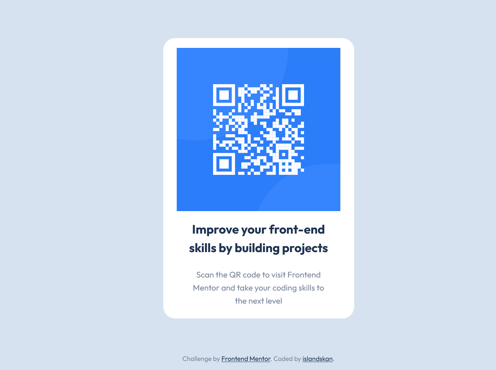

# Frontend Mentor - QR code component solution

This is a solution to the [QR code component challenge on Frontend Mentor](https://www.frontendmentor.io/challenges/qr-code-component-iux_sIO_H). Frontend Mentor challenges help you improve your coding skills by building realistic projects.

## Table of contents

-   [Overview](#overview)
    -   [Screenshot](#screenshot)
    -   [Links](#links)
-   [My process](#my-process)
    -   [Built with](#built-with)
    -   [What I learned](#what-i-learned)
    -   [Continued development](#continued-development)
    -   [Useful resources](#useful-resources)
-   [Author](#author)

## Overview

### Screenshot

-   Desktop
    

-   Mobile
    

### Links

-   Solution URL: [Github repo](https://github.com/islandskan/frontend-mentor-qr-code-component)
-   Live Site URL: [Deployed with Netlify](https://islandskan-fm-qr-code.netlify.app/)

## My process

### Built with

-   Semantic HTML5 markup
-   CSS custom properties
-   Flexbox
-   CSS Grid
-   CSS Grid areas
-   CSS clamp() function
-   Mobile-first workflow
-   Grunt taskrunner with PostCSS plugins
-   Compress and optimize images using taskrunner and plugins

### What I learned

Starting on the project, I decided to try some things I had never worked with before:

-   For CSS:

    -   `grid-template-areas` to center the card component and making a layout that could dynamically adjust to different screen sizes **without** using media queries.
    -   CSS math/bound functions to create dynamic sizing/calculations.
    -   Since you have to be a pro member to get Figma files of the design(and I don't have a pro account), the challenge was to get as close as possible to the design by only looking at the preview images.

-   I recently took an online course about web site optimization, and one of the things I wanted to try was automated optimization of images and css styles **without** some CSS preprocessor. Therefore, I chose to work with:
    -   Grunt.js, since I wanted to start with a taskrunner/automation tool that was easy to understand, and that didn't require a ton of setups and config files to just run a small project.
    -   Some PostCSS-plugins to minify and fix CSS
    -   How to use Imagemin and imagemin plugins in the Gruntfile.

While working and finishing up the project, my major learning points were: - I struggled a lot with getting the width and the height of the card right on different screen sizes. Even when the design looked good in the "Responsive Design Mode" in the "Inspection tools", did I found myself confused when the card looked off _after_ pushing and deploying! In particular, I couldn't get the height of the card on smaller screens right without having the text inside the card overflow below the view height. - The solution was to test out the card on an actual phone screen, and try different heights for the middle row in the `grid-template-rows` until it looked good on both my dekstop and mobile. - Below is the final style snippet for the grid-layout that seemed to work for the card:

```css
body {
    ...
    ...
    display: grid;
    grid-template-columns: 1fr clamp(320px, 40%, 350px) 1fr;
    row-gap: 10vh;
    grid-template-rows: 0.4fr clamp(360px, 65%, 600px) 0.4fr;
    grid-template-areas:
        '. . .'
        '. card .'
        'footer footer footer';
}
```

### Continued development

-   I want to work more with dynamic grid layouts, since they made it so easy to set a responsive layout without having a lot of media queries. I still struggle a bit to fully understand `auto-fill`, `auto-fit`, `min-max`, and `clamp()`.
-   I would like to use `clamp()` for other things like font-sizes, paddings, and animations.
-   When I finally got Grunt.js to work, I really enjoyed it! However, all of the vulnerabilites in the grunt package and the imaginemin plugins are a bit alarming. The fact that most of them are listed as "unmaintained projects" and/or haven't been updated in the last 2-3 years" doesn't help😰
-   So I'm going to learn more about task runners and task automation in general and try some other build tools in the next projects!

### Useful resources

-   [This answer at Stack Overflow on the question 'How to set the maximum width of a column in CSS Grid Layout?'](https://stackoverflow.com/a/75229481/20934380) - Searched for ways to set a "range" of min-width and max-width for a specific column with Grid layout, because I didn't want to use `auto-fill` or `auto-fit`. Found this answer as a helpful stepping stone to further read about and test `.clamp()`
-   [CSS .clamp()](https://blog.bitsrc.io/css-clamp-the-responsive-combination-weve-all-been-waiting-for-f1ce1981ea6e) - article that helped me get an overview of the css bounds functions
-   [CSS-tricks](https://css-tricks.com/use-css-clamp-to-create-a-more-flexible-wrapper-utility/) - Short video illustrating the difference between `max-width` and `.clamp()`.
-   [Practical Uses of CSS Math functions](https://moderncss.dev/practical-uses-of-css-math-functions-calc-clamp-min-max/) - good overview of the CSS math functions `.calc()`, `.min()`, `.max()`, `.clamp()` and how you can use them for different things.
-   [CSS Box-shadow generator](https://cssgenerator.org/box-shadow-css-generator.html) - Since I can't remember the box-shadow property values, this is my go to generator
-   [Gruntjs Docs](https://gruntjs.com/getting-started) - Red up on what Grunt actually can do and how you configure tasks and plugins
-   [GitHub Repo for Grunt PostCSS-plugin](https://github.com/C-Lodder/grunt-postcss)
-   [Github repo for Grunt imagemin-plugin](https://github.com/gruntjs/grunt-contrib-imagemin)

## Author

-   Github - [islandskan](https://github.com/islandskan)
-   Frontend Mentor - [@islandskan](https://www.frontendmentor.io/profile/islandskan)
-   LinkedIn - [@Sigridur Eggertsdottir](https://www.linkedin.com/in/sigridureggertsdottir/)
